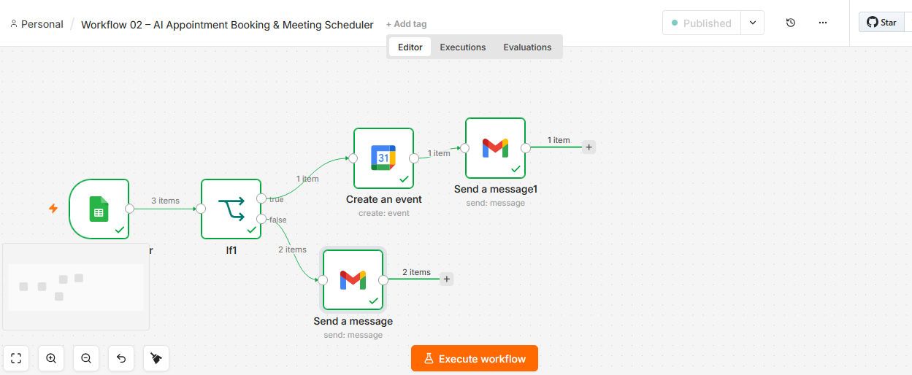

# Workflow 02: AI Appointment Booking & Meeting Scheduler



---

# Project Overview

As I continued learning automation with n8n, I wanted to build something that solves a real business problem instead of creating a workflow only for practice.

One challenge I noticed is that many freelancers, agencies, consultants, and service-based businesses still manage appointment requests manually. A client submits a request, someone checks the form, sends a reply, creates a calendar event, and manually keeps track of everything.

The process works when there are only a few requests. However, as inquiries increase, it becomes repetitive, time-consuming, and difficult to manage consistently.

To solve this problem, I built an AI Appointment Booking & Meeting Scheduler workflow using n8n.

This workflow automatically captures meeting requests, sends confirmation emails, creates calendar events when needed, and routes appointments through different business processes based on the selected meeting type.

The goal was simple:

Reduce manual work, improve client experience, and create a professional appointment management process that can scale as the business grows.

---

# Workflow Overview


This workflow follows the process below:

```text
Google Form
      │
      ▼
Google Sheets
      │
      ▼
Google Sheets Trigger
      │
      ▼
IF Node
├── Strategy Session
│       ▼
│   Create Calendar Event
│       ▼
│   Send Confirmation Email
│
└── Other Meeting Types
        ▼
    Send Confirmation Email
```

```

---

# Workflow Export

The complete n8n workflow export can be found here:

```text
workflow-json/workflow-02-ai-appointment-booking-meeting-scheduler.json
```

This file can be imported directly into n8n for testing, customization, or learning purposes.

---

# Business Problem

Before building this workflow, appointment requests required several manual actions.

A client would submit a request.

Then someone would need to:

* Review the request manually
* Send a confirmation email
* Create a calendar event
* Track meeting information
* Organize client communication

While these tasks seem simple individually, they become repetitive and difficult to manage when appointment volume increases.

As more requests arrive, the chances of delayed responses, missed appointments, and scheduling mistakes increase.

---

# Buyer Pain Points

This workflow solves several common business challenges.

### Slow Response Times

Clients often wait hours or even days before receiving confirmation that their request was received.

### Manual Scheduling

Creating calendar events manually takes time and increases the risk of errors.

### Inconsistent Communication

Without automation, client communication can vary depending on who responds.

### Lost Opportunities

Delayed follow-ups can result in lost consultations and missed business opportunities.

### Administrative Overload

Business owners spend valuable time managing schedules instead of focusing on revenue-generating activities.

---

# Solution

This workflow automates the entire appointment booking process.

When a client submits a booking request:

1. Information is collected through Google Forms.
2. Responses are stored automatically in Google Sheets.
3. Google Sheets Trigger detects the new submission.
4. The IF node evaluates the selected meeting type.
5. Strategy Sessions automatically create calendar events.
6. Personalized confirmation emails are sent automatically.
7. Different meeting types follow different workflow paths.

The result is a faster, more organized, and scalable appointment management system.

---

# Technologies Used

* n8n
* Google Forms
* Google Sheets
* Gmail
* Google Calendar

---

# Nodes Used

### Google Sheets Trigger

Monitors new form submissions and starts the workflow automatically.

### IF Node

Makes decisions based on the selected meeting type.

### Google Calendar

Creates calendar events automatically for qualifying appointments.

### Gmail

Sends personalized confirmation emails automatically.

---

# Episode Breakdown

## Episode 01 – Meeting Request Form Setup

The first step was creating a structured meeting request form.

Instead of collecting information through scattered emails and messages, I built a centralized form that gathers all required information before a consultation.

The form collects:

* Full Name
* Email Address
* Company Name
* Preferred Date
* Preferred Time
* Meeting Type
* Project Details

All responses are automatically stored in Google Sheets, creating a clean and organized data source for the automation workflow.

---

## Episode 02 – Automated Email Confirmation

After connecting Google Sheets with n8n, I automated client communication.

Whenever a new meeting request is submitted, the workflow automatically sends a personalized confirmation email.

This ensures every client receives an immediate response without waiting for manual follow-up.

From a business perspective, this improves professionalism and builds trust from the very beginning of the client relationship.

---

## Episode 03 – Automated Calendar Event Creation

The next goal was eliminating manual scheduling work.

I integrated Google Calendar into the workflow so that appointments can be scheduled automatically.

When the workflow receives a qualifying meeting request, it creates a calendar event using the information submitted by the client.

This reduces administrative work and ensures every appointment is recorded consistently.

---

## Episode 04 – Smart Meeting Routing with IF Logic

Not every meeting type requires the same process.

To make the workflow more intelligent, I implemented conditional routing using an IF node.

Strategy Sessions automatically create calendar events and send confirmation emails.

Other meeting types follow a different path and receive email confirmations only.

This approach mirrors how real businesses operate and makes the workflow more flexible and scalable.

---

# Real Business Use Cases

This workflow can be used by:

* Freelancers
* Consultants
* Coaches
* Agencies
* Marketing Teams
* AI Automation Agencies
* SaaS Companies
* Service-Based Businesses
* Appointment-Based Businesses

---

# Business Benefits

### Faster Response Times

Clients receive confirmation immediately after submitting a request.

### Reduced Administrative Work

Scheduling and communication tasks are automated.

### Better Client Experience

Clients receive professional communication without delays.

### Improved Organization

Meeting information is stored in a structured and centralized system.

### Scalability

The process can handle increasing appointment volume without increasing manual work.

---

# ROI & Buyer Value

From a business perspective, the value of this workflow goes beyond automation.

Instead of spending time on repetitive scheduling tasks, teams can focus on higher-value activities such as sales, client communication, and service delivery.

Benefits include:

* Faster lead response
* Improved client experience
* Reduced operational workload
* Better appointment organization
* Lower risk of missed meetings
* Increased efficiency

Even small improvements in response time can have a significant impact on lead conversion rates.

---

# Testing Evidence

The workflow was tested using multiple meeting scenarios.

### Strategy Session

Result:

* Calendar Event Created
* Confirmation Email Sent

### Discovery Call

Result:

* Confirmation Email Sent
* No Calendar Event Created

### Support Call

Result:

* Confirmation Email Sent
* No Calendar Event Created

All workflow paths performed successfully.

---

# Skills Demonstrated

This project demonstrates practical experience with:

* n8n Workflow Development
* Workflow Automation
* Business Process Design
* Conditional Logic
* Email Automation
* Calendar Automation
* Google Workspace Integration
* Client Communication Automation
* Process Optimization

---

# Challenges & Lessons Learned

One of the most valuable lessons from this project was learning how to design workflows around business requirements instead of focusing only on technical implementation.

Connecting tools is relatively easy.

The real challenge is understanding how businesses operate and designing workflows that support those processes effectively.

This project helped me improve both my technical skills and my ability to think like an automation consultant.

---

# Future Improvements

Potential future enhancements include:

* Google Meet link generation
* Automated reminder emails
* SMS notifications
* CRM integration
* AI-powered lead qualification
* Dynamic calendar availability checking
* Follow-up automation sequences

---

# Freelancer Delivery Package

If delivered to a client, this project would include:

* Fully documented n8n workflow
* Workflow export JSON file
* Setup instructions
* Testing evidence
* Customization guidance
* Business process explanation

---

# Client FAQ

### Can this workflow be customized?

Yes. Meeting types, emails, scheduling rules, and integrations can all be customized.

### Can it work with other calendars?

Yes. Additional calendar integrations can be added depending on business requirements.

### Can reminders be added?

Yes. Reminder emails and SMS notifications can be integrated easily.

### Can it connect to a CRM?

Yes. Systems such as HubSpot, Airtable, Notion, and other CRMs can be connected.

---

# Portfolio Statement

This project represents a complete appointment booking and scheduling automation system built with n8n.

More importantly, it demonstrates my approach to automation.

Rather than simply connecting tools together, I focus on understanding the business problem first and then building practical solutions that reduce manual work, improve efficiency, and create a better experience for clients.

This workflow showcases my ability to analyze a process, identify repetitive tasks, and transform them into scalable automation systems using n8n.
